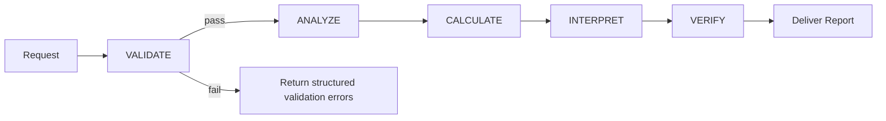

# FinAnalyst-Pro Agent Tools

[](https://www.python.org/)
[](https://docs.pydantic.dev/)
[](#decimal-safety--precision)
[](./AGENT_SYSTEM_PROMPT.md)
[](LICENSE)

A **validation-first, Decimal-safe** financial analysis toolset designed to power an LLM-driven “financial analyst” agent.

This repo contains:
- `finanalyst_tools/`: a Python toolset implementing a **5-phase analysis pipeline** (Validate → Analyze → Calculate → Interpret → Verify), with strict numeric handling and audit trails.
- `AGENT_SYSTEM_PROMPT.md`: the agent system prompt contract (grounding, security, workflow, and output template).

---

## Table of Contents

- [What this is](#what-this-is)
- [Key features](#key-features)
- [Quick start](#quick-start)
- [Tool catalog](#tool-catalog)
- [Data model](#data-model)
- [Pipeline and architecture](#pipeline-and-architecture)
- [LLM integration notes](#llm-integration-notes)
- [Repository structure](#repository-structure)
- [Development](#development)
- [License](#-license)

---

## What this is

FinAnalyst-Pro is built around a simple idea:

- **Never compute on unvalidated data.**
- **Never leak floats across tool boundaries.**
- **Always produce auditable, explainable results** suitable for LLM consumption.

The toolset is intentionally split into:
- **Orchestration**: a pipeline that enforces phase gating and produces a top-level result.
- **Validation**: schema checks, completeness checks, reconciliation checks, plausibility checks.
- **Calculations**: metric-level computations (profitability, liquidity).
- **Registry/Dispatcher**: safe tool invocation + argument normalization (including nested numeric coercion).

---

## Key features

- **Validation-first workflow**
  - Mandatory schema validation and completeness checks.
  - Cross-statement reconciliation and plausibility checks.

- **Decimal safety and precision**
  - Tool boundary coercion normalizes numeric inputs (including nested structures) to `Decimal`.
  - JSON serialization uses `Decimal`-safe patterns to avoid float precision loss.

- **Auditable results**
  - Each metric returns a `CalculationResult` with:
    - inputs used
    - calculation steps (audit trail)
    - plausibility flags and warnings

- **Agent-ready interfaces**
  - `ToolRegistry.get_openai_tools()` / `get_anthropic_tools()` produce tool schemas.
  - `expose_to_llm` controls which tools are visible to the model.

- **Agent prompt contract included**
  - `AGENT_SYSTEM_PROMPT.md` documents the required pipeline, output format, and security constraints.

---

## Quick start

### 1) Create a virtual environment

```bash
python -m venv .venv
. .venv/bin/activate
```

### 2) Install dependencies

This repo does not currently ship a `requirements.txt` or `pyproject.toml`. The toolset imports `pydantic`.

```bash
python -m pip install --upgrade pip
python -m pip install pydantic
```

### 3) Run a minimal end-to-end analysis

The highest-level tool is `analyze_financials`.

```bash
python - <<'PY'
from finanalyst_tools.tool_registry import ToolRegistry

registry = ToolRegistry()

statement_set = {
    "income_statement": {
        "period": {"year": 2023, "period_type": "annual"},
        "currency": "SGD",
        "total_revenue": 1000000.5,
        "cost_of_goods_sold": 600000.25,
        "operating_expenses": 200000.125,
        "net_income": 150000.0,
    },
    "balance_sheet": {
        "period": {"year": 2023, "period_type": "annual"},
        "currency": "SGD",
        "cash_and_equivalents": 100000.1,
        "inventory": 150000.0,
        "accounts_receivable": 120000.0,
        "accounts_payable": 90000.0,
        "total_current_assets": 500000.0,
        "total_current_liabilities": 300000.0,
        "total_assets": 800000.0,
        "total_liabilities": 450000.0,
        "total_shareholders_equity": 350000.0,
    },
}

report_md = registry.execute_tool(
    "analyze_financials",
    statement_set=statement_set,
    analysis_type="comprehensive",
    include_trends=False,
    currency="SGD",
    report_format="markdown",
    include_audit_trail=False,
)

print(report_md[:1200])
PY
```

### 4) Sanity check compilation

```bash
python -m compileall -q finanalyst_tools
```

---

## Tool catalog

### LLM-exposed orchestration tools

These are the intended agent-facing tools.

| Tool | Category | Purpose | Returns |
|------|----------|---------|---------|
| `analyze_financials` | `analysis` | Runs the full 5-phase pipeline and returns a formatted report | Markdown report string (or JSON string) |
| `validate_financial_data` | `validation` | Validates data completeness for an analysis type | `ValidationResult` reasoning block |

### Internal calculation tools

These are registered but marked `expose_to_llm=False` (usable by internal orchestration, hidden from the model’s direct tool menu).

| Tool | Category | Metric |
|------|----------|--------|
| `calculate_gross_profit_margin` | `profitability` | Gross Profit Margin |
| `calculate_operating_profit_margin` | `profitability` | Operating Profit Margin |
| `calculate_net_profit_margin` | `profitability` | Net Profit Margin |
| `calculate_ebitda_margin` | `profitability` | EBITDA Margin |
| `calculate_return_on_assets` | `profitability` | ROA |
| `calculate_return_on_equity` | `profitability` | ROE |
| `calculate_return_on_capital_employed` | `profitability` | ROCE |
| `calculate_current_ratio` | `liquidity` | Current Ratio |
| `calculate_quick_ratio` | `liquidity` | Quick Ratio |
| `calculate_cash_ratio` | `liquidity` | Cash Ratio |
| `calculate_working_capital` | `liquidity` | Working Capital |

---

## Data model

### `FinancialStatementSet`

The primary input payload maps to `finanalyst_tools.models.financial_statements.FinancialStatementSet`:

- `income_statement`: required
- `balance_sheet`: required
- `cash_flow_statement`: optional

Each statement includes a `period`:

```json
{
  "year": 2023,
  "period_type": "annual"
}
```

Notes:
- Many numeric fields accept `int`, `float`, `str`, or `Decimal`. Tool boundaries normalize numerics to `Decimal`.
- Field aliases are supported in several places (see validation’s `FIELD_ALIASES`).

---

## Pipeline and architecture

### 5-phase workflow

The orchestration layer implements the mandatory phase sequence.



### Decimal safety & precision

- Numeric coercion is enforced at tool boundaries (including nested dict/list payloads).
- Serialization uses a central helper (`finanalyst_tools.utils.serialization.to_jsonable`) to keep `Decimal` values safe for JSON.

---

## LLM integration notes

### Use the system prompt

The agent contract lives in:

- `./AGENT_SYSTEM_PROMPT.md`

It specifies:
- grounding and security rules
- mandatory phase ordering
- a report output template

### Tool schema generation

`ToolRegistry` can generate tool schemas for function-calling providers:

```python
from finanalyst_tools.tool_registry import ToolRegistry

registry = ToolRegistry()
openai_tools = registry.get_openai_tools()      # only expose_to_llm=True
anthropic_tools = registry.get_anthropic_tools() # only expose_to_llm=True
```

### Dispatcher

If you prefer a “tool call executor” abstraction:

```python
from finanalyst_tools.dispatcher import ToolDispatcher

dispatcher = ToolDispatcher()
result = dispatcher.execute(
    "analyze_financials",
    parameters={"statement_set": {"income_statement": {...}, "balance_sheet": {...}}},
)
print(result.success)
```

---

## Repository structure

```text
finanalyst_tools/
  calculations/
    base.py
    profitability.py
    liquidity.py
  models/
    financial_statements.py
    analysis_results.py
    validation.py
  orchestration/
    pipeline.py
    confidence_scorer.py
    report_generator.py
  validation/
    schema_validator.py
    reconciliation.py
    plausibility.py
    utils.py
  utils/
    serialization.py
    math_ops.py
    formatting.py
    currency.py
  tool_registry.py
  dispatcher.py
  exceptions.py
  config.py
AGENT_SYSTEM_PROMPT.md
```

---

## Development

### Recommended checks

- Compile:

```bash
python -m compileall -q finanalyst_tools
```

### Adding new tools

- Register the tool in `finanalyst_tools/tool_registry.py`.
- Decide whether it should be model-visible via `expose_to_llm`.
- Ensure any numeric inputs are safe at boundaries (prefer `Decimal`).

---

## 📄 License

FinAnalyst-Pro is released under the **MIT License**. See the [LICENSE](LICENSE) file for details.

```text
MIT License

Copyright (c) 2025 Your Name

Permission is hereby granted, free of charge, to any person obtaining a copy
of this software and associated documentation files (the "Software"), to deal
in the Software without restriction, including without limitation the rights
to use, copy, modify, merge, publish, distribute, sublicense, and/or sell
copies of the Software, and to permit persons to whom the Software is
furnished to do so, subject to the following conditions:

The above copyright notice and this permission notice shall be included in all
copies or substantial portions of the Software.

THE SOFTWARE IS PROVIDED "AS IS", WITHOUT WARRANTY OF ANY KIND, EXPRESS OR
IMPLIED, INCLUDING BUT NOT LIMITED TO THE WARRANTIES OF MERCHANTABILITY,
FITNESS FOR A PARTICULAR PURPOSE AND NONINFRINGEMENT. IN NO EVENT SHALL THE
AUTHORS OR COPYRIGHT HOLDERS BE LIABLE FOR ANY CLAIM, DAMAGES OR OTHER
LIABILITY, WHETHER IN AN ACTION OF CONTRACT, TORT OR OTHERWISE, ARISING FROM,
OUT OF OR IN CONNECTION WITH THE SOFTWARE OR THE USE OR OTHER DEALINGS IN THE
SOFTWARE.
```

